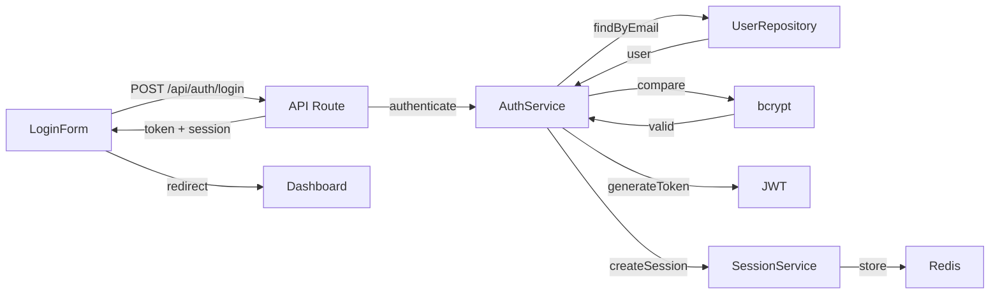

Generate a task-focused code trace showing how code flows for a specific feature or behavior.

Usage:
- `/wogi-trace [prompt]` - Generate new trace
- `/wogi-trace list` - List saved traces
- `/wogi-trace [name]` - Load existing trace

## Examples

```
/wogi-trace "user authentication flow"
/wogi-trace "how does payment processing work"
/wogi-trace "data flow from form submit to database"
/wogi-trace "the checkout process"
```

## What It Generates

A task-focused map showing:
1. **Flow overview** - High-level summary of how the feature works
2. **Components involved** - Each file/function with line numbers
3. **Execution order** - The sequence of how code runs
4. **Diagram** - Visual mermaid flowchart
5. **Related files** - Other files that might be relevant

## Output Format

```markdown
# Code Trace: Authentication Flow

> Generated: 2024-01-15 10:30
> Query: "user authentication flow"

## Flow Overview

User submits login form → API validates credentials → JWT generated →
Session created → User redirected to dashboard

## Execution Flow

### 1. Entry Point: Login Form
**File**: `src/components/auth/LoginForm.tsx`
**Lines**: 45-89
**Role**: Captures user credentials and initiates login

Key code:
```tsx
const handleSubmit = async (data: LoginData) => {
  const result = await authService.login(data);
  // ...
}
```

### 2. API Route: POST /api/auth/login
**File**: `src/pages/api/auth/login.ts`
**Lines**: 12-67
**Role**: Validates request, calls auth service

Key code:
```ts
export default async function handler(req, res) {
  const { email, password } = req.body;
  const user = await AuthService.authenticate(email, password);
  // ...
}
```

### 3. Auth Service
**File**: `src/services/auth.service.ts`
**Lines**: 34-78
**Role**: Core authentication logic

Key code:
```ts
async authenticate(email: string, password: string) {
  const user = await this.userRepo.findByEmail(email);
  const valid = await bcrypt.compare(password, user.passwordHash);
  // ...
}
```

### 4. JWT Generation
**File**: `src/services/auth.service.ts`
**Lines**: 80-95
**Role**: Creates signed JWT token

### 5. Session Storage
**File**: `src/services/session.service.ts`
**Lines**: 20-45
**Role**: Stores session in Redis

## Diagram



## Related Files

| File | Relevance |
|------|-----------|
| `src/middleware/auth.ts` | JWT verification middleware |
| `src/hooks/useAuth.ts` | Client-side auth state |
| `src/context/AuthContext.tsx` | Auth context provider |
| `src/types/auth.ts` | Type definitions |

## Security Notes

- Passwords hashed with bcrypt (cost factor 12)
- JWT expires in 24 hours
- Refresh token rotation enabled
- Rate limiting: 5 attempts per minute

---
*Trace saved to: .workflow/traces/authentication-flow.md*
```

## How Traces Work

1. **Parse prompt** - Understand what flow/feature to trace
2. **Search codebase** - Find entry points and related files
3. **Analyze dependencies** - Follow imports and function calls
4. **Build execution graph** - Determine order of operations
5. **Generate documentation** - Create readable trace with code snippets
6. **Create diagram** - Generate mermaid flowchart
7. **Save trace** - Store for future reference

## Trace Storage

Traces are saved to `.workflow/traces/[name].md`:
- Reusable across sessions
- Shareable with team
- Can be referenced in Cascade/Claude

## Using Traces

### Reference in context
```
/wogi-context TASK-050
# Also loads relevant traces
```

### Before starting a task
```
/wogi-trace "the feature I'm about to modify"
# Understand before editing
```

### Onboarding
```
/wogi-trace "core user flows"
/wogi-trace "data models and relationships"
/wogi-trace "API architecture"
```

### Debugging
```
/wogi-trace "how errors propagate in the payment flow"
/wogi-trace "where user data gets validated"
```

## Configuration

In `config.json`:
```json
"traces": {
  "saveTo": ".workflow/traces",
  "generateDiagrams": true
}
```

## Difference from App Map

| App Map | Trace |
|---------|-------|
| Static registry | Dynamic, task-focused |
| What exists | How it executes |
| All components | Only relevant ones |
| No flow info | Shows execution order |
| Manual updates | Generated on demand |

## Tips

- Be specific: "user login flow" > "authentication"
- Ask about behaviors: "what happens when X"
- Focus on one flow at a time
- Re-trace after major refactors
