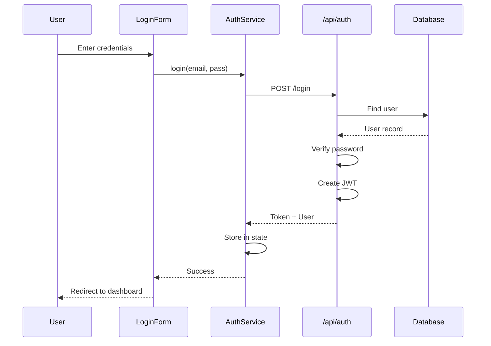

# Code Traces

Understand how code flows for specific features or behaviors.

---

## Purpose

Code traces help you:
- Understand how features work
- Find all files involved in a flow
- Create diagrams of code paths
- Document architecture

---

## Configuration

```json
{
  "traces": {
    "saveTo": ".workflow/traces",
    "generateDiagrams": true
  }
}
```

---

## Usage

### Generate a Trace

```bash
/wogi-trace "user authentication flow"
```

### Output

```
🔍 Code Trace: User Authentication Flow

Entry Points:
  → src/pages/login.tsx
  → src/components/LoginForm.tsx

Flow:
  1. LoginForm.tsx
     ├── Renders form with email/password
     ├── Calls: useAuth hook
     └── On submit: authService.login()

  2. src/hooks/useAuth.ts
     ├── Manages auth state (Zustand)
     ├── Calls: authService methods
     └── Returns: user, login, logout

  3. src/services/authService.ts
     ├── login(email, password)
     │   └── POST /api/auth/login
     ├── logout()
     │   └── DELETE /api/auth/session
     └── refreshToken()
         └── POST /api/auth/refresh

  4. src/pages/api/auth/login.ts
     ├── Validates credentials
     ├── Creates JWT token
     └── Sets httpOnly cookie

Files Involved: 7
Total Lines: ~450

Diagram saved: .workflow/traces/auth-flow.md
```

---

## Trace Types

### Feature Trace

```bash
/wogi-trace "checkout process"
```

Traces a complete user feature.

### Component Trace

```bash
/wogi-trace component Button
```

Traces where a component is used.

### API Trace

```bash
/wogi-trace api "/api/users"
```

Traces an API endpoint's flow.

---

## Diagram Generation

When `generateDiagrams` is enabled:

```markdown
# Auth Flow Diagram


```

---

## Trace Files

Saved to `.workflow/traces/`:

```
.workflow/traces/
├── auth-flow.md
├── checkout-process.md
├── button-usage.md
└── api-users.md
```

### Trace File Format

```markdown
# Trace: User Authentication Flow

Generated: 2024-01-15 10:30

## Summary
Authentication flow from login form to API to database.

## Entry Points
- src/pages/login.tsx
- src/components/LoginForm.tsx

## Files
| File | Role | Lines |
|------|------|-------|
| LoginForm.tsx | UI | 45 |
| useAuth.ts | State | 62 |
| authService.ts | Service | 85 |
| login.ts | API | 120 |

## Flow Diagram
[Mermaid diagram]

## Key Functions
- `login(email, password)` - Main auth entry
- `createToken(user)` - JWT generation
- `validatePassword(input, hash)` - Verification

## Notes
- Uses JWT with 1hr expiry
- Refresh token in httpOnly cookie
- Rate limited to 5 attempts/minute
```

---

## Commands

| Command | Purpose |
|---------|---------|
| `/wogi-trace "<description>"` | Create feature trace |
| `/wogi-trace component <name>` | Trace component usage |
| `/wogi-trace api "<endpoint>"` | Trace API endpoint |

---

## Use Cases

### Understanding Legacy Code

```bash
/wogi-trace "how does the payment system work"
```

### Onboarding New Developer

```bash
/wogi-trace "main application flow"
```

### Debugging

```bash
/wogi-trace "error handling in API"
```

### Documentation

```bash
/wogi-trace "data sync process" --save
```

---

## Integration with Tasks

Traces can feed into task planning:

```
1. Generate trace
2. Identify all files involved
3. Create task with file list
4. Use trace for context during implementation
```

---

## Best Practices

1. **Start Broad**: Use general descriptions first
2. **Refine**: Add specifics if trace is too large
3. **Save Important Traces**: Good for documentation
4. **Update After Changes**: Regenerate stale traces
5. **Use for Planning**: Understand before modifying

---

## Troubleshooting

### Trace Too Large

Be more specific:
```bash
# Too broad
/wogi-trace "user management"

# Better
/wogi-trace "user password reset flow"
```

### Missing Files

- Check if files are in indexed directories
- Ensure file extensions are supported
- Verify imports are standard format

### Diagrams Not Generating

Check `generateDiagrams` is true and Mermaid syntax is valid.

---

## Related

- [Task Planning](../02-task-execution/01-task-planning.md) - Using traces for planning
- [Component Indexing](../01-setup-onboarding/component-indexing.md) - File discovery
- [Configuration](../configuration/all-options.md) - All settings
